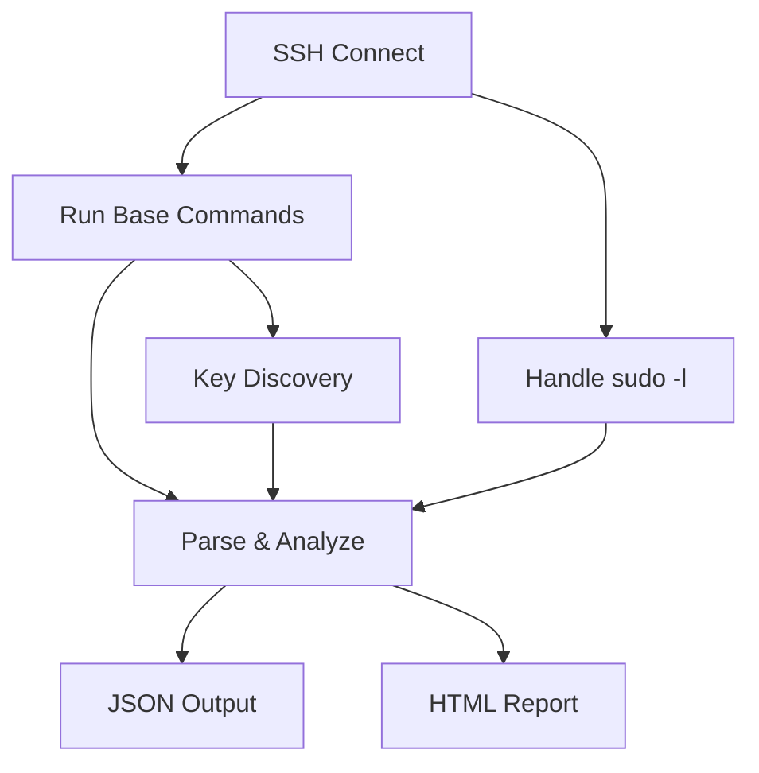

> **Project Description**  
> SSH-based Linux enumeration tool: collects system data, parses sudo rules, lists SUID/SGID, samples world‑writable paths, and discovers potential SSH private keys. Generates JSON and HTML reports, handles non‑interactive sudo, and supports verbose mode.                                               

---

## 📚 Table of Contents
- [Overview](#overview)
- [Features](#features)
- [Architecture](#architecture)
- [Installation](#installation)
- [Quickstart](#quickstart)
- [Usage](#usage)
- [CLI Options](#cli-options)
- [Output Formats](#output-formats)
- [HTML Report Anatomy](#html-report-anatomy)
- [Enumeration Details](#enumeration-details)
  - [Sudo Parsing](#sudo-parsing)
  - [SUID/SGID Discovery](#suidsgid-discovery)
  - [World‑Writable Sampling](#worldwritable-sampling)
  - [SSH Private Key Discovery](#ssh-private-key-discovery)
- [Performance Tips](#performance-tips)
- [Security & Privacy](#security--privacy)
- [Configuration & Extensibility](#configuration--extensibility)
- [Programmatic Use](#programmatic-use)
- [Exit Codes](#exit-codes)
- [Troubleshooting](#troubleshooting)
- [FAQ](#faq)
- [Roadmap](#roadmap)
- [Contributing](#contributing)
- [Versioning](#versioning)
- [Changelog Template](#changelog-template)
- [License](#license)
- [Author](#author)

---

## Overview
**Escalation Master** is an SSH-based Linux enumeration and reporting tool. It performs non-destructive checks to collect system information, parse `sudo` rules, enumerate SUID/SGID binaries, sample world‑writable directories, and search for candidate SSH private keys. Results are saved as structured **JSON** and a readable **HTML** report. Non‑interactive `sudo` is handled gracefully and a `--verbose` mode is available for step‑by‑step logging.

---

## Features
- 🔑 SSH authentication via password or private key
- ⚙ Non‑interactive `sudo` handling (tries `sudo -n -l`, falls back to `-S` + PTY with `--sudo-pass`)
- 🔎 `sudo -l` parsing with highlights and quick reference links
- 🧱 SUID/SGID enumeration with “interesting” binary marking
- ✍ Sampling of world‑writable directories (limited for speed)
- 🗝 SSH private key discovery via constrained filename/signature scans
- 🧾 Dual output: JSON (raw + parsed) and HTML (visual summary)
- 🗣 `--verbose` progress logs with timing for each step

---

## Architecture

Core steps:
1. Connect via SSH (`paramiko`)  
2. Execute base enumeration commands  
3. Obtain `sudo -l` using non‑interactive mode or stdin + PTY  
4. Parse outputs, build highlights and suggestions  
5. Generate JSON + HTML outputs

---

## Installation
```bash
git clone https://github.com/yourusername/escalation-master.git
cd escalation-master
pip install paramiko
chmod +x escalation-master.py
```

---

## Quickstart
```bash
# Password authentication
python3 escalation-master.py   --host 10.10.142.87   --user alex   --password Superpass123   --sudo-pass Superpass123   --verbose   --out result.json   --html report.html

# Private key authentication
python3 escalation-master.py   --host 10.10.158.44   --user lab_user   --pkey ~/.ssh/id_rsa   --sudo-pass MySudoPass123   --out ssh_enum.json   --html ssh_report.html
```

---

## Usage
```text
Escalation Master (SSH enumerator)

Required:
  --host HOST            Target host/IP
  --user USER            SSH username
Auth (one of):
  --password PASS        SSH password
  --pkey PATH            SSH private key
Optional:
  --port PORT            SSH port (default: 22)
  --sudo-pass PASS       Password for 'sudo -l' if non‑interactive mode requires it
  --out FILE             JSON output path (default: escalation_result.json)
  --html FILE            HTML output path (default: escalation_report.html)
  --verbose              Enable detailed progress logs
```

---

## CLI Options
| Option | Type | Default | Description |
|---|---|---|---|
| `--host` | string | — | Target host/IP |
| `--user` | string | — | SSH username |
| `--port` | int | 22 | SSH port |
| `--password` | string | — | SSH password |
| `--pkey` | path | — | SSH private key path |
| `--sudo-pass` | string | — | Password to obtain `sudo -l` via stdin + PTY when needed |
| `--out` | path | `escalation_result.json` | JSON output file |
| `--html` | path | `escalation_report.html` | HTML report file |
| `--verbose` | flag | off | Verbose progress logs |

---

## Output Formats

### JSON (example)
```json
{
  "results": {
    "id": { "out": "uid=1000(user) gid=1000(user)", "err": "", "status": 0 },
    "sudo -l (handled)": { "out": "...", "err": "", "method": "stdin-pty" }
  },
  "analysis": {
    "highlights": ["sudo NOPASSWD for python3.", "SUID/SGID binary of interest: /usr/bin/vim"],
    "world_writable_sample": ["drwxrwxrwt root root /tmp"]
  }
}
```

### HTML
The HTML report includes highlights, parsed `sudo -l`, SUID/SGID table, potential SSH key samples, world‑writable directory sample, and selected raw outputs.

---

## HTML Report Anatomy
- **Quick highlights** — concise list of notable items  
- **Manual Review Suggestions** — links to documentation, man pages, and search  
- **Parsed `sudo -l`** — raw entries, `NOPASSWD` marks, command references  
- **SUID/SGID** — compact table with “interesting” markers  
- **World‑writable (sample)** — short list for review  
- **Raw outputs** — selected command outputs for context

---

## Enumeration Details

### Sudo Parsing
- Tries `sudo -n -l` first (no prompt)  
- Falls back to `sudo -k -S -p '' -l` with PTY when `--sudo-pass` is provided  
- Parses lines to detect `NOPASSWD` and extract command paths  
- Builds quick links for each command name (docs/man/search)

### SUID/SGID Discovery
- Scans common binary directories: `/bin /sbin /usr/bin /usr/sbin /usr/local/bin`  
- Marks “interesting” names (e.g., `vim`, `tar`, `python3`, `find`)  
- Includes up to 500 entries in HTML (performance‑friendly)

### World‑Writable Sampling
- Constrained `find` with filesystem exclusions (`/proc`, `/sys`, `/dev`, `/run`, `/snap`)  
- Prints sample of up to 100 entries in raw results; 15 shown in HTML

### SSH Private Key Discovery
- Lists `~/.ssh` for all homes and `/root/.ssh`  
- Filename patterns: `id_rsa`, `id_ed25519`, `*.pem`, `*.key`, etc.  
- Signature grep: `BEGIN OPENSSH PRIVATE KEY`, `BEGIN RSA PRIVATE KEY`  
- Results summarized in HTML; full lines available in JSON

---

## Performance Tips
- Use `--verbose` for diagnostics; disable for speed in large scans  
- Adjust command lists inside the script to tune performance  
- Network latency affects SSH execution; consider running locally where possible

---

## Security & Privacy
- The tool reads system metadata and file listings; it does not modify the system.  
- Sensitive paths are listed but not copied; review outputs responsibly.  
- Control where outputs are stored (`--out`, `--html`).

---

## Configuration & Extensibility
- All command lists are defined near the top of the script (`DEFAULT_CMDS`, `SSH_KEY_CMDS`).  
- You can remove, add, or reorder commands to match your environment.  
- HTML generation is centralized in `make_html()` and can be customized.

**Example: disabling world‑writable sampling**
```python
# Remove from DEFAULT_CMDS:
# "find / -xdev -path /proc -prune ... | head -n 100 || true",
```

**Example: adding a custom check**
```python
CUSTOM_CMDS = ["cat /etc/group", "df -h", "mount"]
# Then run them similarly to DEFAULT_CMDS in main().
```

---

## Programmatic Use
You can import parts of the script into another Python program (or vendor the file and `import escalation_master` after renaming).

```python
from escalation_master import exec_cmd, analyze

# Example: execute a command on an existing Paramiko SSH client
out, err, status = exec_cmd(ssh, "uname -a", get_pty=False, verbose=True)
```

---

## Exit Codes
- `0` — completed successfully  
- `1` — connection error or fatal runtime error

---

## Troubleshooting
- **`a terminal is required`** → provide `--sudo-pass` to enable stdin + PTY mode.  
- **No output in HTML** → confirm that JSON was created and contains `analysis`.  
- **Slow scans** → remove the heavy `find`/`grep` commands in the script or limit paths.  
- **Auth issues** → verify user, key permissions (`chmod 600`), and `sshd_config` settings.

---

## FAQ
**Q:** Can I run only part of the checks?  
**A:** Yes—edit `DEFAULT_CMDS` and `SSH_KEY_CMDS` in the script.

**Q:** How do I save results in a different folder?  
**A:** Use `--out /path/file.json --html /path/file.html`.

**Q:** What shells/binaries are “interesting”?  
**A:** See the `INTERESTING_BINS` set in the script.

---

## Roadmap
- Flag switches to toggle specific modules (`--no-key-scan`, `--no-world-writable`)  
- CSV export for selected tables  
- Colored console highlights and progress bars  
- Pluggable modules via entry points

---

## Contributing
1. Fork the repo  
2. Create a feature branch  
3. Add tests (where appropriate) and update documentation  
4. Open a PR with a clear summary of changes

---

## Versioning
Semantic-ish: `MAJOR.MINOR.PATCH` with pragmatic increments based on feature and fix scope.

---

## Changelog Template
```markdown
## [1.2.0] — 2025-10-17
### Added
- New option `--no-key-scan` to skip private key discovery.

### Changed
- Optimized SUID enumeration and HTML rendering.

### Fixed
- Corrected parsing of localized `sudo -l` outputs.
```

---

## License
MIT — see `LICENSE` file.

---

## Author
**rootL3M**  
